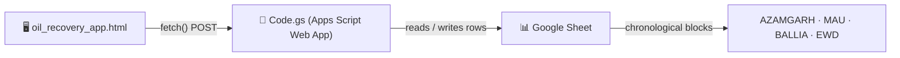

 

---

## 📋 About

**Oil Recovery Register** ek single-file web app hai jo Electricity Workshop Centres (AZAMGARH, MAU, BALLIA, EWD) ke liye:

- 🔧 Transformer **Repair** aur **DTC** data monthly entry
- 🛢️ **Oil Balance** tracking (Fresh Oil, B&C Oil, Reclaim Oil, O&U)
- 📊 Custom date-range **Summary Reports** (Opening balance hamesha "From Month" se)
- 📥 One-click **Excel export** — original template format me
- ☁️ Har entry seedha **aapki Google Sheet** me chronological order me save hoti hai

---

## ⚙️ How it works

1. `oil_recovery_app.html` browser me khulti hai — koi install nahi chahiye
2. Data entry form se values Apps Script Web App ko bheji jaati hain
3. `Code.gs` sahi centre ke sheet-tab me sahi jagah (month order maintain karke) block insert/update karti hai
4. Summary tab se kisi bhi date range ka report Excel me download ho sakta hai

---

## 🚀 Setup

1. Apni Google Sheet kholo → **Extensions → Apps Script**
2. `Code.gs` ka poora content paste karo
3. **Deploy → New deployment → Web app**
   - Execute as: **Me**
   - Who has access: **Anyone**
4. Mile hue `.../exec` URL ko copy karo
5. `oil_recovery_app.html` kholo → **Google Sheet Sync** box me URL paste karo → **Save & Connect**

---

## 📁 Files

| File | Kaam |
|---|---|
| `oil_recovery_app.html` | Poora frontend app — data entry + summary + Excel export |
| `Code.gs` | Google Apps Script backend — Sheet ke saath read/write bridge |

---

**Made for PUVVNL Electricity Workshop Centres**

